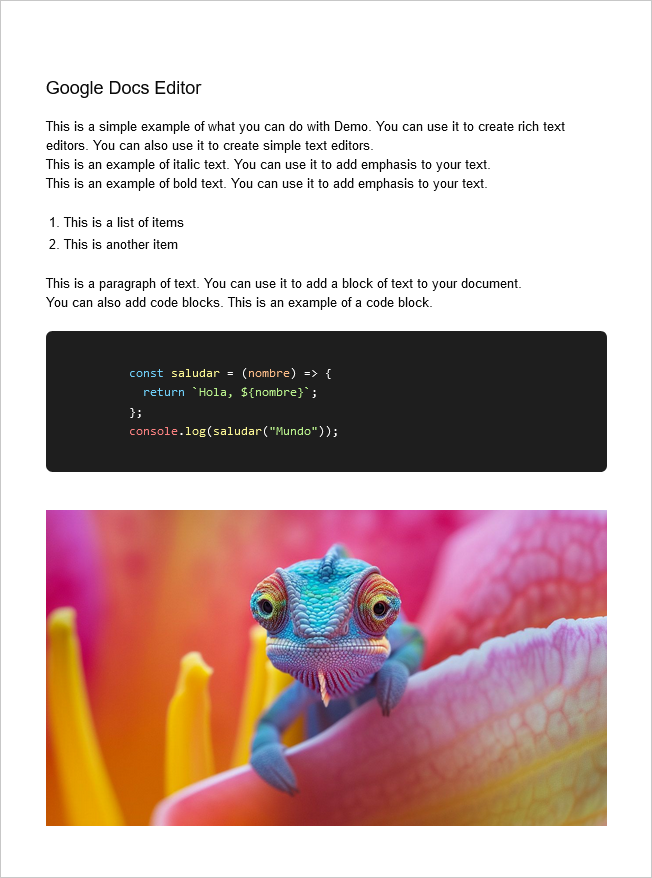

# 🚀 Real Time Google Docs Clone

Un clon moderno y en tiempo real de Google Docs que permite la edición colaborativa de documentos. Este proyecto combina tecnologías de vanguardia para ofrecer una experiencia de edición fluida y en tiempo real.





## 📋 Tabla de Contenidos

- [Características](#características)
- [Tecnologías Utilizadas](#tecnologías-utilizadas)
- [Comenzando](#comenzando)
- [Instalación](#instalación)
- [Uso](#uso)
- [Documentación API](#documentación-api)
- [Contribución](#contribución)
- [Pruebas](#pruebas)
- [Despliegue](#despliegue)
- [Licencia](#licencia)

## ✨ Características

- **Editor Rico en Tiempo Real**

  - Edición colaborativa en tiempo real
  - Formateo de texto completo
  - Soporte para imágenes y tablas
  - Sistema de comentarios
  - Listas y listas de tareas
  - Resaltado de código
  - Cambio de color de texto
  - Cambio de familia de fuentes
  - Subrayado y estilos de texto
  - Tablas redimensionables
  - Imágenes redimensionables

- **Interfaz de Usuario Moderna**

  - Diseño responsivo
  - Tema claro/oscuro
  - Barra de herramientas personalizable
  - Interfaz intuitiva tipo Google Docs
  - Visualización de datos interactiva
  - Componentes UI modernos con Radix
  - Sistema de notificaciones con Sonner
  - Carruseles y navegación avanzada

- **Gestión de Documentos**
  - Guardado automático
  - Control de versiones
  - Exportación a diferentes formatos
  - Organización de documentos
  - Compartir documentos

## 🛠 Tecnologías Utilizadas

### Frontend

- Next.js 15
- React 19
- TypeScript
- TipTap Editor con extensiones:
  - Code Block con sintaxis highlighting
  - Tablas
  - Listas de tareas
  - Imágenes redimensionables
  - Colores y resaltado
- Zustand para gestión de estado
- Tailwind CSS
- ShadcN UI
- Radix UI Components:
  - Accordion
  - Alert Dialog
  - Avatar
  - Context Menu
  - Dialog
  - Dropdown Menu
  - Navigation Menu
  - y más...
- Lucide Icons
- Sonner para notificaciones
- React Hook Form
- Zod para validación
- Recharts para gráficos
- Embla Carousel

### Backend

- Cloudflare Workers
- Node.js
- WebSocket para tiempo real

### Testing

- Jest
- React Testing Library
- Cypress

### DevOps

- GitHub Actions
- Cloudflare
- Wrangler CLI

## 🚀 Comenzando

### Prerrequisitos

- Node.js (v16 o superior)
- npm o yarn
- Wrangler CLI (para desarrollo con Cloudflare Workers)

### Instalación

1. Clonar el repositorio

```bash
git clone https://github.com/usuario/real-time-google-docs-clone.git
cd real-time-google-docs-clone
```

2. Instalar dependencias

```bash
npm install
```

3. Configurar variables de entorno

```bash
cp .env.example .env.local
```

4. Iniciar el servidor de desarrollo

```bash
npm run dev
```

5. Para desarrollo con Cloudflare Workers

```bash
npm run dev:worker
```

El proyecto estará disponible en `http://localhost:3000`

## Scripts Disponibles

```json
{
	"dev": "next dev",
	"build": "next build",
	"start": "next start",
	"lint": "next lint",
	"build:worker": "cloudflare",
	"dev:worker": "wrangler dev --port 8771",
	"preview:worker": "npm run build:worker && npm run dev:worker",
	"deploy:worker": "npm run build:worker && wrangler deploy"
}
```

## 🧪 Pruebas

```bash
# Ejecutar pruebas unitarias
npm run test

# Ejecutar pruebas e2e
npm run test:e2e
```

## 📦 Despliegue

```bash
# Construir para producción
npm run build

# Desplegar en Cloudflare Workers
npm run deploy:worker
```

## 📄 Licencia

Este proyecto está bajo la Licencia MIT - ver el archivo [LICENSE.md](LICENSE.md) para más detalles.
